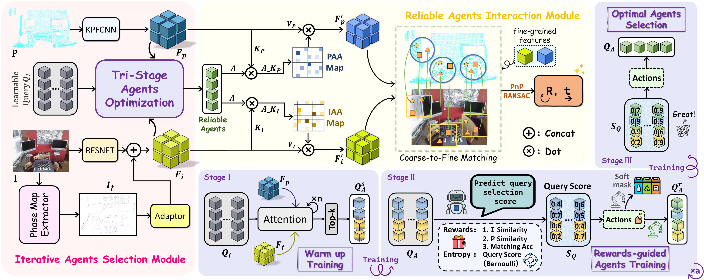

# A2SI: Adaptive Agent Selection and Interaction Network for Image-to-Point Cloud Registration

### AAAI 2026

Official PyTorch implementation of **A2SI: Adaptive Agent Selection and Interaction Network for Image-to-Point Cloud Registration**, accepted by **The Fortieth AAAI Conference on Artificial Intelligence (AAAI-26)**.

A2SI is a detector-free image-to-point cloud registration network. It improves cross-modal feature aggregation by adaptively selecting reliable agents and using them to guide image-point cloud interaction, thereby reducing mismatches caused by repetitive structures, non-overlapping regions, and illumination variations.

<p align="center">
  
</p>

## Introduction

Image-to-point cloud registration aims to estimate the rigid transformation **[R, t]** between a 2D image and a 3D point cloud captured from the same scene. It is a fundamental task in 3D reconstruction, SLAM, visual localization, and embodied perception.

Existing detector-free methods usually follow a coarse-to-fine pipeline. They first extract image and point cloud features, then establish patch-level correspondences, refine them into dense pixel-to-point matches, and finally estimate the rigid transformation using PnP-RANSAC. However, directly aggregating cross-modal features with conventional transformer-based interaction may introduce noise under challenging conditions.

Two major issues remain:

1. **Unreliable cross-modal feature aggregation.**
   In scenes with repetitive structures, non-overlapping regions, or illumination changes, direct image-point cloud similarity computation may lead to incorrect correspondences.

2. **Difficulty in selecting informative cross-modal representations.**
   Images mainly encode texture and color, while point clouds encode geometric structure. Without dedicated design, it is difficult to identify reliable and representative features that are truly useful for cross-modal matching.

To address these challenges, we propose **A2SI**, which contains two key components:

* **Iterative Agents Selection Module (IAS)**
  IAS enhances the structural awareness of image features using phase maps and selects reliable agents from redundant learnable queries through a reinforcement-learning-inspired Tri-Stage Agents Optimization strategy.

* **Reliable Agents Interaction Module (RAI)**
  RAI uses the selected reliable agents as a bridge to guide cross-modal feature aggregation. It replaces direct full feature interaction with agent-guided interaction, reducing attention noise and improving correspondence reliability.

## Method Overview

Given an image **I** and a point cloud **P**, A2SI follows a detector-free coarse-to-fine registration framework.

First, image features are extracted by a ResNet-FPN backbone, and point cloud features are extracted by a KPFCNN backbone. A phase map extractor is introduced to enhance the image feature sensitivity to edge structures. Then, the **Iterative Agents Selection Module (IAS)** selects reliable agents from redundant learnable queries through a Tri-Stage Agents Optimization strategy.

The selected reliable agents are then used in the **Reliable Agents Interaction Module (RAI)** to guide cross-modal feature aggregation between image and point cloud features. After coarse-level matching, dense fine-level correspondences are further refined using high-resolution features. Finally, **PnP-RANSAC** is used to estimate the rigid transformation **[R, t]**.

## Iterative Agents Selection Module

The **Iterative Agents Selection (IAS)** module is designed to select informative and reliable agents for cross-modal registration.

### Phase Map Extractor

Images and point clouds have different data structures and encoding mechanisms. Images are dense 2D grids that mainly capture texture and color, while point clouds are sparse and unordered 3D data that mainly capture geometry. To reduce this modality gap, A2SI introduces a phase map extractor.

The phase component of the Fourier spectrum preserves structural and textural information. Therefore, A2SI uses phase maps to enhance image sensitivity to edge structures, making image features more compatible with point cloud geometric features.

### Tri-Stage Agents Optimization

To select reliable agents, A2SI initializes redundant learnable queries and optimizes them through a three-stage strategy:

1. **Stage I: Warm-up Training**
   Redundant learnable queries interact with image and point cloud features to learn meaningful cross-modal representations.

2. **Stage II: Rewards-guided Agents Training**
   A reinforcement-learning-inspired strategy evaluates each query from both local and global perspectives. The local reward measures query similarity to image and point cloud features, while the global reward reflects the contribution of the query to the overall matching objective.

3. **Stage III: Optimal Agents Selection**
   After training, the model selects the optimal agents according to the learned query scores. These agents are used for cross-modal aggregation in the RAI module.

This adaptive strategy avoids the rigidity of simple top-k selection and improves the robustness of cross-modal feature aggregation.

## Reliable Agents Interaction Module

The **Reliable Agents Interaction (RAI)** module uses the selected reliable agents as a bridge between image and point cloud features.

Instead of treating all image and point cloud tokens equally, RAI first selects informative agents that carry key cross-modal correlation information. These agents are used as queries, while image and point cloud features serve as keys and values. This design filters noisy regions before cross-modal interaction and makes attention more focused on reliable structures.

RAI effectively suppresses noise from repetitive patterns, non-overlapping regions, and illumination changes, producing more accurate image-to-point cloud correspondences.

## Main Results

We evaluate A2SI on **RGB-D Scenes V2** and **7Scenes**.

| Dataset         | IR ↑ | FMR ↑ | RR ↑ |
| :-------------- | :--: | :---: | :--: |
| RGB-D Scenes V2 | 38.6 |  94.3 | 73.1 |
| 7Scenes         | 54.1 |  93.1 | 79.9 |

The evaluation metrics include:

* **IR**: Inlier Ratio, the percentage of pixel-to-point matches whose 3D distance is below 5 cm.
* **FMR**: Feature Matching Recall, the percentage of image-point cloud pairs whose inlier ratio is above 10%.
* **RR**: Registration Recall, the percentage of image-point cloud pairs whose registration RMSE is below 10 cm.

## Installation

Please use the following command for installation.

```bash
# It is recommended to create a new environment
conda create -n a2si python=3.8
conda activate a2si

# Install vision3d following https://github.com/qinzheng93/vision3d
```

The code has been tested on Python 3.8, PyTorch 1.13.1, Ubuntu 22.04, GCC 11.3, and CUDA 11.7, but it should work with other compatible configurations.

## Implementation Details

A2SI is implemented using PyTorch 1.13.1 and trained on an NVIDIA GeForce RTX 3090 GPU. The number of attention layers is set to **3** by default. The number of selected agents is fixed to **12**. The initial temperature parameter **τ** is set to **20.0** and decayed by a factor of **0.9** every 10 epochs until reaching a minimum value of **5.0**. The entropy regularization weight is set to **0.01**, and the soft masking coefficient is set to **0.3**.

## Data Preparation

We evaluate A2SI on **7Scenes** and **RGB-D Scenes V2** following the same data organization as 2D3D-MATR.

Please put all datasets under the `data` directory.

```text
--data
   |--7Scenes
   |--RGBDScenesV2
```

## 7Scenes

### Data Preparation

The data should be organized as follows:

```text
--data--7Scenes--metadata
              |--data--chess
                     |--fire
                     |--heads
                     |--office
                     |--pumpkin
                     |--redkitchen
                     |--stairs
```

### Training

The code for 7Scenes is in:

```text
experiments/A2SI.7scenes
```

Use the following command for training:

```bash
cd experiments/A2SI.7scenes
CUDA_VISIBLE_DEVICES=0 python trainval.py
```

### Testing

Use the following command for testing:

```bash
CUDA_VISIBLE_DEVICES=0 ./eval.sh EPOCH
```

`EPOCH` is the epoch id.

We also provide pretrained weights in `weights`. Use the following command to test the pretrained weights:

```bash
CUDA_VISIBLE_DEVICES=0 python test.py --checkpoint=/path/to/A2SI/weights/A2SI-7scenes.pth
CUDA_VISIBLE_DEVICES=0 python eval.py --test_epoch=-1
```

## RGB-D Scenes V2

### Data Preparation

The data should be organized as follows:

```text
--data--RGBDScenesV2--metadata
              |--data--rgbd-scenes-v2-scene_01
                     |--...
                     |--rgbd-scenes-v2-scene_14
```

### Training

The code for RGB-D Scenes V2 is in:

```text
experiments/A2SI.rgbdv2
```

Use the following command for training:

```bash
cd experiments/A2SI.rgbdv2
CUDA_VISIBLE_DEVICES=0 python trainval.py
```

### Testing

Use the following command for testing:

```bash
CUDA_VISIBLE_DEVICES=0 ./eval.sh EPOCH
```

`EPOCH` is the epoch id.

We also provide pretrained weights in `weights`. Use the following command to test the pretrained weights:

```bash
CUDA_VISIBLE_DEVICES=0 python test.py --checkpoint=/path/to/A2SI/weights/A2SI-rgbdv2.pth
CUDA_VISIBLE_DEVICES=0 python eval.py --test_epoch=-1
```

## Citation

If you find this project useful in your research, please consider citing:

```bibtex
@inproceedings{cheng2026a2si,
  author    = {Cheng, Zhixin and Yin, Xiaotian and Deng, Jiacheng and Liao, Bohao and Chen, Yujia and Zhou, Xu and Yin, Baoqun and Zhang, Tianzhu},
  title     = {Adaptive Agent Selection and Interaction Network for Image-to-Point Cloud Registration},
  booktitle = {Proceedings of the AAAI Conference on Artificial Intelligence},
  year      = {2026},
  pages     = {3335--3343}
}
```

## Acknowledgements

This work was supported by the National Key Research and Development Program of China under Grant No. 2024YFB3909902 and the Youth Innovation Promotion Association of the Chinese Academy of Sciences.

**We sincerely thank the authors of 2D3D-MATR for their excellent work and publicly available codebase. Our implementation is partially built upon their repository.**

## License

This project is released for academic research. Please refer to the `LICENSE` file for more details.
